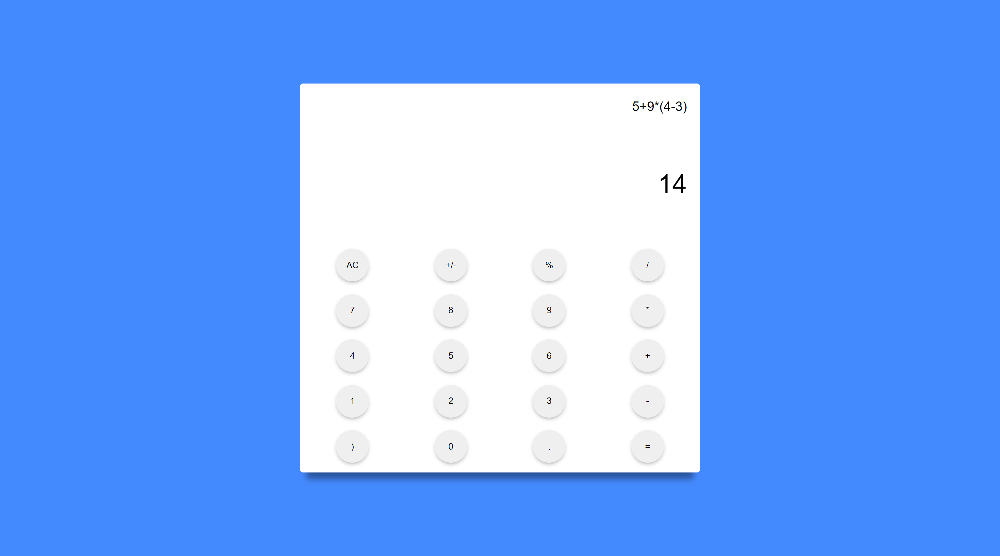
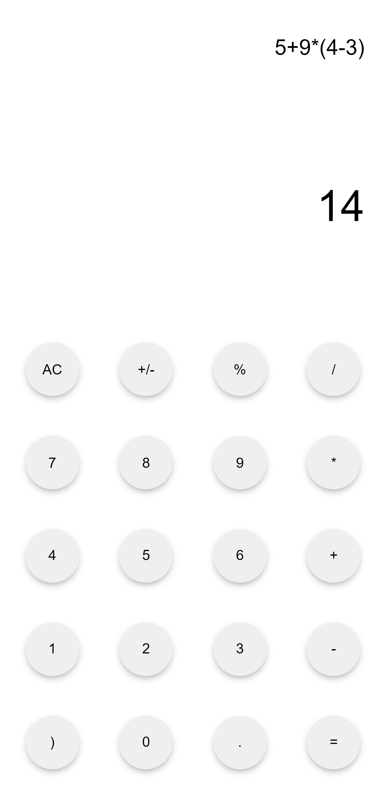

  <h1>JSCalc</h1>

**🔥 Description**  

A simple calculator made using html,css,sass and javascript.  
It uses LL1 recursive descent parsing method to parse the input.

**************************** Note!! ****************************
 
It may contain some bug(s), but I'm sure you can fix it easily.

**🎥 Timelapse video**  
- LINK: https://youtu.be/pKTkqA_04W8

**📗 Working page**  
- LINK: https://andydevs69420.github.io/JSCalc/

# 📷 SAMPLE SCREENSHOTS

  
  

